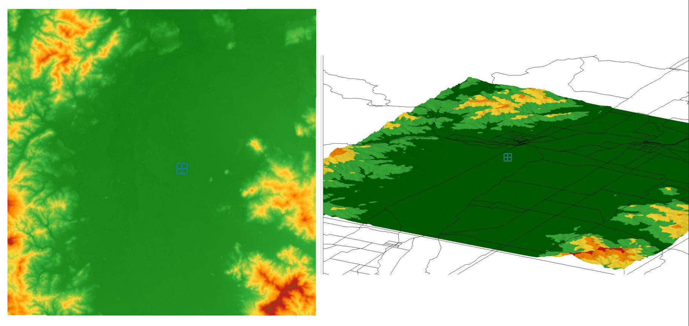
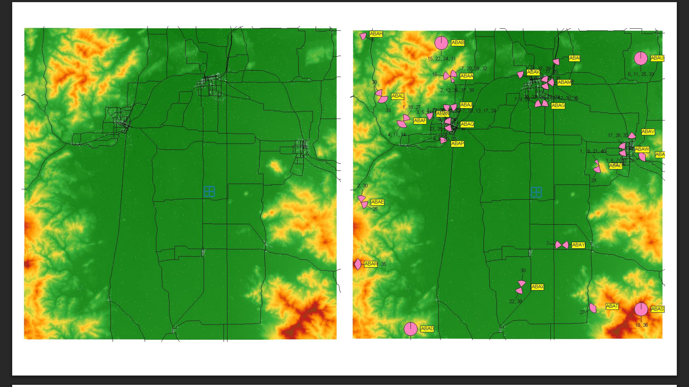
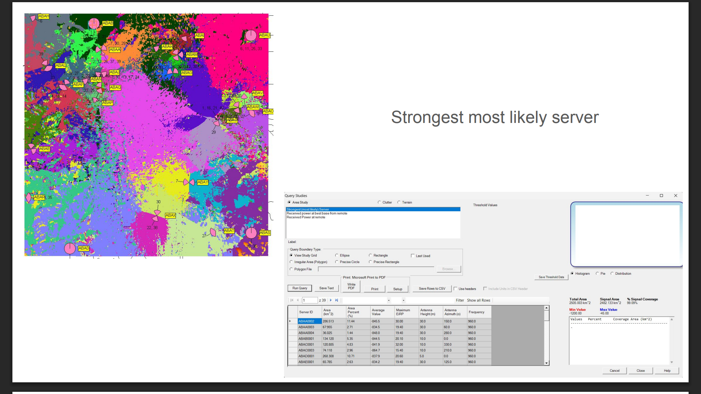

# 2G Cellular Network Planning — AGH Cellular Systems Project

Academic group project focused on designing and planning a 2G cellular network for a defined geographical area using **EDX SignalPro**.

## Project overview

The objective was to design a cellular network adapted to the geographical conditions and expected traffic distribution of the selected area.

The project involved:

- selecting and positioning base stations
- defining cell sizes and coverage areas
- assigning channels based on expected traffic
- configuring transmission power, antenna type, tilt and azimuth
- analysing the resulting network coverage and capacity

## My role

I was responsible for preparing the initial project configuration and views, selecting the area used for the project, positioning base stations according to geographical conditions and expected traffic.

Moreover, I coordinated task distribution within the team and contributed to the analysis and presentation of the final network design.

## Project Preview

### Geographical Area

### Base Station Placement

### Cellular Coverage

